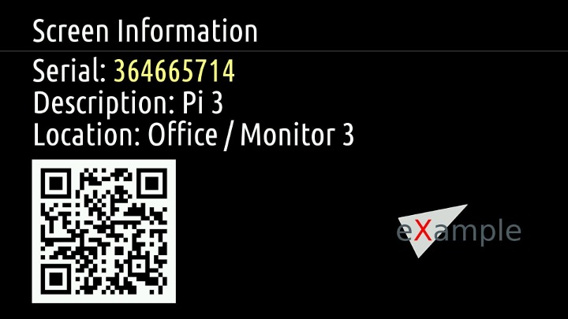

# Shows information about a device

Sometimes you want to set up a lot of screens at once. It might be
difficult to track which Pi is connected to which screen. This
packages tries to solve this problem by showing you essential
information about the connected Pi on the screen.

Here is what the output might look like:

# Information provided

 * **Serial**: This is the serial number of your Pi that you can also see on the devices page.
   It is colored in yellow to make it easier to communicate if you have to give someone
   instructions over the phone.

 * **Description**: This is the description you assigned to the device on the devices page. This
   information isn't pushed to the device, so it might take a moment to update if you
   make changes to it on the devices page.

 * **Location**: This is the location you assigned to the device. Similar to the description
   updating this might take a moment.

 * **QR Code**: When you're logged into your info-beamer account and scan the QR code you
   get redirected to the device detail page for the device. This allows you to easily
   modify setting for the device right in front of you without navigating through
   the devices page.

 * **Logo**: You can assign a custom logo that appears on the screen.

# Questions / Feedback

Either visit the contact page or use the issue tracker
on https://github.com/info-beamer/package-screen-info/issues.
